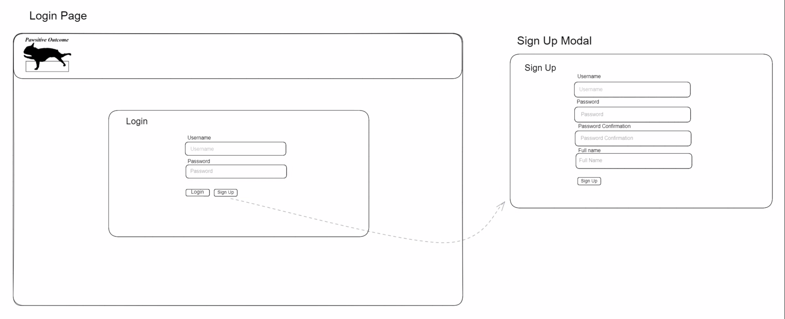
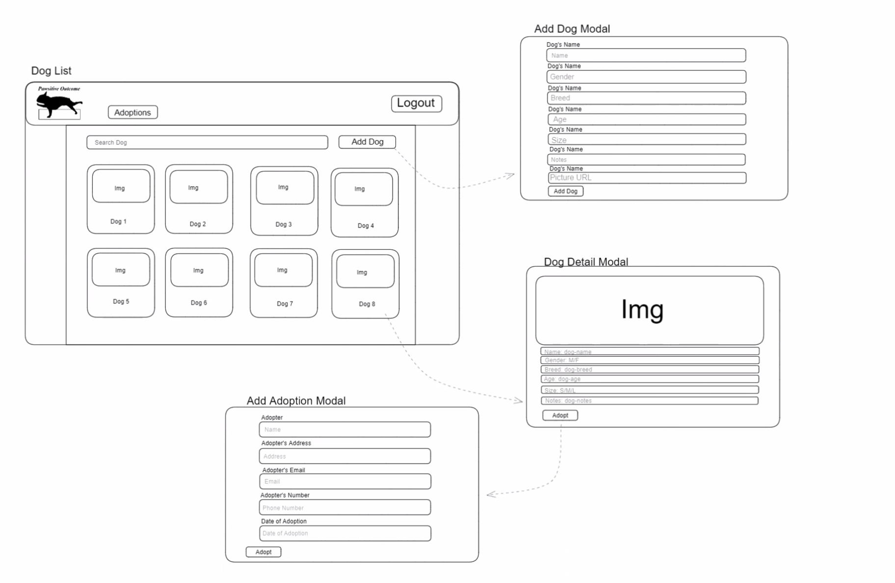
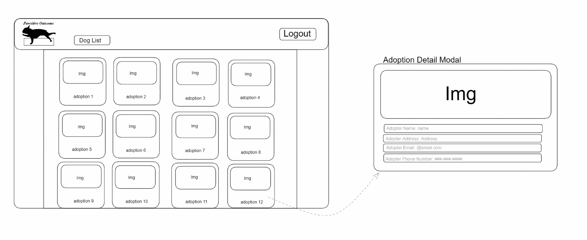

# EMPLOYEE GHI

## Login/Signup

This will be the initail page an employee sees when arriving. They will be required to login, or sign up of they are new to Pawsitive Outcome.

## Dogs List/Related Modals

This will serve as the main page for the application once an employee has signed in. It will list all dogs available for adoption, on cards, in a grid layout. Here you are able to add a dog to the kennel, or find a particular dog by name via a search bar. Clicking a button on the card will activate a modal to show details about the specific dog, with an "Adopt" button. Clicking "Adopt" will bring up and adoption form as modal to finalize the adoption process.

## Adoption List/Adoption Detail Modal

This page will be where an employee can go to view the records of all adoptions made by Pawsitive Outcome. Clicking on a specific adoption will activate a modal to show a photo of the dog, and provide details about that adoption

